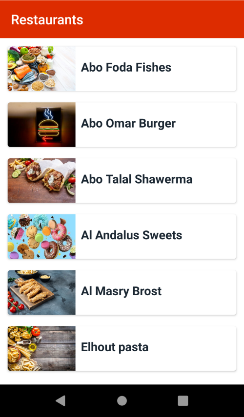
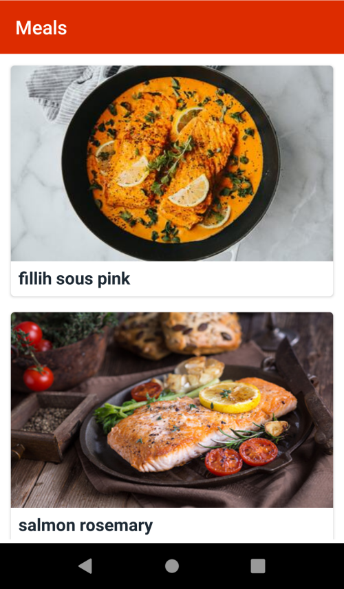
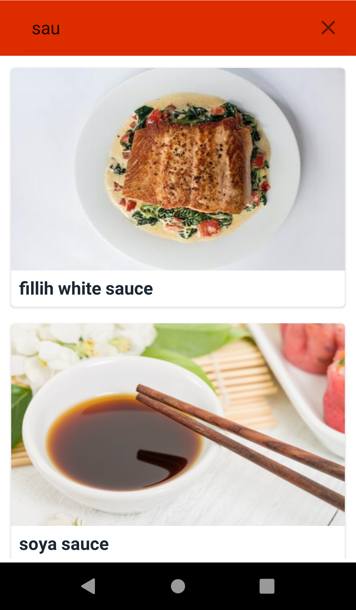
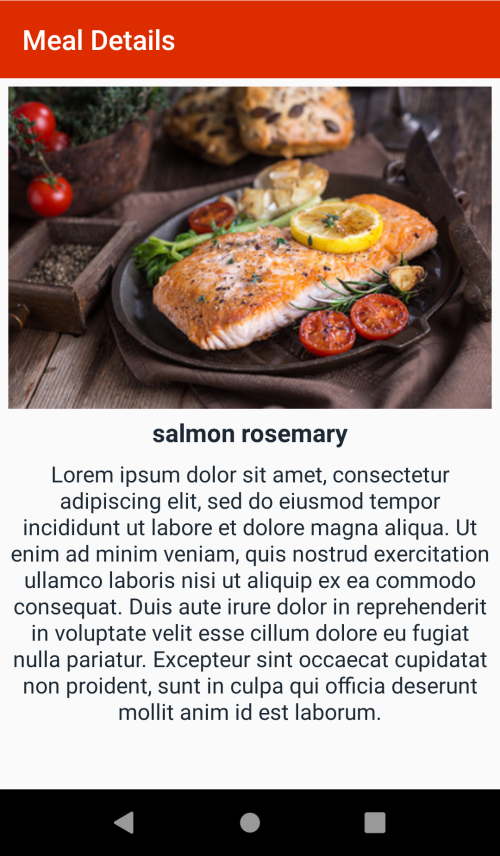

# Restaurants
Restaurants app displays a list of restaurants and meals
- it uses a backend api to get data and cache it locally using room.
- it allow filtering the current meals and restaurants list.
- each restart it connect to the backend and gets what was updated recently.

 

# Screenshots:

 

  
   

 

  
   

 

# Tech Stack

- Architecture
    - Clean Architecture
    - MVVM Architecture (ViewModel - UseCases - Model)
    - Repository pattern

- Kotlin (main branch), Java (java branch)

- Reactive Programming
    - RxJava
    - LiveData

- Other
    - View Binding
    - Gson
    - Glide
    
- Room

- Dependency Injection
    - dagger 2
    
- Testing
    - Unit Tests
    - Instrumentation Tests
    - Mockito
    
- Networking
    - Retrofit
    - REST APIs / JSON

- SOLID

 

# License & Copyright
Copyright (c) 2021 **Muhammad-2021**

 [MIT License](LICENSE)
